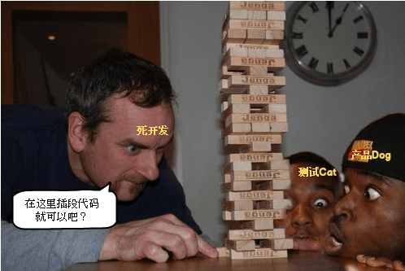

# 小程序之告别 setData
众所周知 Vue 是借助 ES5 的 `Object.defineProperty` 方法设置 getter、setter 达到数据驱动界面，当然其中还有模板编译等等其他过程。

而小程序官方的 api 是在 `Page` 中调用 `this.setData` 方法来改变数据，从而改变界面。

那么假如我们将两者结合一下，将 `this.setData` 封装起来，岂不是可以像开发 Vue 应用一样地使用 `this.foo = 'hello'` 来开发小程序了？

* 更进一步地，可以实现 h5 和小程序 js 部分代码的同构
* 更进一步地，增加模板编译和解析就可以连 wxml/html 部分也同构
* 更进一步地，兼容 RN/Weex/快应用
* 更进一步地，世界大同，天下为公，前端工程师全部失业...23333


## 0.源码地址
* [git.code 地址](http://git.code.oa.com/sports-libs/tua-mp.git)
* [github 地址](https://github.com/tuateam/tua-mp)

## 1.绑定简单属性
第一步我们先定一个小目标：~~挣他一个亿！！！~~

**对于简单非嵌套属性（非对象，数组），直接对其赋值就能改变界面。**

```html
<!-- index.wxml -->
<view>msg: {{ msg }}</view>
<button bindtap="tapMsg">change msg</button>
```

```js
// index.js
TuaPage({
    data () {
        return {
            msg: 'hello world',
        }
    },
    methods: {
        tapMsg () {
            this.msg = this.reverseStr(this.msg)
        },
        reverseStr (str) {
            return str.split('').reverse().join('')
        },
    },
})
```

这一步很简单啦，直接对于 data 中的每个属性都绑定下 getter、setter，在 setter 中调用下 `this.setData` 就好啦。

```js
/**
 * 将 source 上的属性代理到 target 上
 * @param {Object} source 被代理对象
 * @param {Object} target 被代理目标
 */
const proxyData = (source, target) => {
    Object.keys(source).forEach((key) => {
        Object.defineProperty(
            target,
            key,
            Object.getOwnPropertyDescriptor(source, key)
        )
    })
}

/**
 * 遍历观察 vm.data 中的所有属性，并将其直接挂到 vm 上
 * @param {Page|Component} vm Page 或 Component 实例
 */
const bindData = (vm) => {
    const defineReactive = (obj, key, val) => {
        Object.defineProperty(obj, key, {
            enumerable: true,
            configurable: true,
            get () { return val },
            set (newVal) {
                if (newVal === val) return

                val = newVal
                vm.setData($data)
            },
        })
    }

    /**
     * 观察对象
     * @param {any} obj 待观察对象
     * @return {any} 已被观察的对象
     */
    const observe = (obj) => {
        const observedObj = Object.create(null)

        Object.keys(obj).forEach((key) => {
            // 过滤 __wxWebviewId__ 等内部属性
            if (/^__.*__$/.test(key)) return

            defineReactive(
                observedObj,
                key,
                obj[key]
            )
        })

        return observedObj
    }

    const $data = observe(vm.data)

    vm.$data = $data
    proxyData($data, vm)
}

/**
 * 适配 Vue 风格代码，使其支持在小程序中运行（告别不方便的 setData）
 * @param {Object} args Page 参数
 */
export const TuaPage = (args = {}) => {
    const {
        data: rawData = {},
        methods = {},
        ...rest
    } = args

    const data = typeof rawData === 'function'
        ? rawData()
        : rawData

    Page({
        ...rest,
        ...methods,
        data,
        onLoad (...options) {
            bindData(this)

            rest.onLoad && rest.onLoad.apply(this, options)
        },
    })
}
```

## 2.绑定嵌套对象
> 那么如果数据是嵌套的对象咋办咧？

其实也很简单，咱们递归观察一下就好。

```html
<!-- index.wxml -->
<view>a.b: {{ a.b }}</view>
<button bindtap="tapAB">change a.b</button>
```

```js
// index.js
TuaPage({
    data () {
        return {
            a: { b: 'this is b' },
        }
    },
    methods: {
        tapAB () {
            this.a.b = this.reverseStr(this.a.b)
        },
        reverseStr (str) {
            return str.split('').reverse().join('')
        },
    },
})
```

`observe` -> `observeDeep`：在 `observeDeep` 中判断是对象就递归观察下去。

```js
// ...

/**
 * 递归观察对象
 * @param {any} obj 待观察对象
 * @return {any} 已被观察的对象
 */
const observeDeep = (obj) => {
    if (typeof obj === 'object') {
        const observedObj = Object.create(null)

        Object.keys(obj).forEach((key) => {
            if (/^__.*__$/.test(key)) return

            defineReactive(
                observedObj,
                key,
                // -> 注意在这里递归
                observeDeep(obj[key]),
            )
        })

        return observedObj
    }

    // 简单属性直接返回
    return obj
}

// ...
```

## 3.劫持数组方法
大家都知道，Vue 劫持了一些数组方法。咱们也来依葫芦画瓢地实现一下~

```js
/**
 * 劫持数组的方法
 * @param {Array} arr 原始数组
 * @return {Array} observedArray 被劫持方法后的数组
 */
const observeArray = (arr) => {
    const observedArray = arr.map(observeDeep)

    ;[
        'pop',
        'push',
        'sort',
        'shift',
        'splice',
        'unshift',
        'reverse',
    ].forEach((method) => {
        const original = observedArray[method]

        observedArray[method] = function (...args) {
            const result = original.apply(this, args)
            vm.setData($data)

            return result
        }
    })

    return observedArray
}
```

> 其实，Vue 还做了个优化，如果当前环境有 `__proto__` 属性，那么就把以上方法直接加到数组的原型链上，而不是对每个数组数据的方法进行修改。

## 4.实现 computed 功能
`computed` 功能日常还蛮常用的，通过已有的 `data` 元数据，派生出一些方便的新数据。

要实现的话，因为 `computed` 中的数据都定义成函数，所以其实直接将其设置为 `getter` 就行啦。

```js
/**
 * 将 computed 中定义的新属性挂到 vm 上
 * @param {Page|Component} vm Page 或 Component 实例
 * @param {Object} computed 计算属性对象
 */
const bindComputed = (vm, computed) => {
    const $computed = Object.create(null)

    Object.keys(computed).forEach((key) => {
        Object.defineProperty($computed, key, {
            enumerable: true,
            configurable: true,
            get: computed[key].bind(vm),
            set () {},
        })
    })

    proxyData($computed, vm)

    // 挂到 $data 上，这样在 data 中数据变化时可以一起被 setData
    proxyData($computed, vm.$data)

    // 初始化
    vm.setData($computed)
}
```

## 5.实现 watch 功能
接下来又是一个炒鸡好用的 `watch` 功能，即监听 `data` 或 `computed` 中的数据，在其变化的时候调用回调函数，并传入 `newVal` 和 `oldVal`。

```js
const defineReactive = (obj, key, val) => {
    Object.defineProperty(obj, key, {
        enumerable: true,
        configurable: true,
        get () { return val },
        set (newVal) {
            if (newVal === val) return

            // 这里保存 oldVal
            const oldVal = val
            val = newVal
            vm.setData($data)

            // 实现 watch data 属性
            const watchFn = watch[key]
            if (typeof watchFn === 'function') {
                watchFn.call(vm, newVal, oldVal)
            }
        },
    })
}

const bindComputed = (vm, computed, watch) => {
    const $computed = Object.create(null)

    Object.keys(computed).forEach((key) => {
        // 这里保存 oldVal
        const oldVal = computed[key].call(vm)

        Object.defineProperty($computed, key, {
            enumerable: true,
            configurable: true,
            get () {
                const newVal = computed[key].call(vm)

                // 实现 watch computed 属性
                const watchFn = watch[key]
                if (typeof watchFn === 'function' && newVal !== oldVal) {
                    watchFn.call(vm, newVal, oldVal)
                }

                return newVal
            },
            set () {},
        })
    })

    // ...
}
```

**看似不错，实则不然。**

咱们现在碰到了一个问题：**如何监听类似 'a.b' 这样的嵌套数据？**

这个问题的原因在于我们在递归遍历数据的时候没有记录下路径。

## 6.记录路径
解决这个问题并不难，其实我们只要在递归观察的每一步中传递 `key` 即可，注意对于数组中的嵌套元素传递的是 `[${index}]`。

并且一旦我们知道了数据的路径，还可以进一步提高 `setData` 的性能。

因为我们可以精细地调用 `vm.setData({ [prefix]: newVal })` 修改其中的部分数据，而不是将整个 `$data` 都 `setData`。

```js
const defineReactive = (obj, key, val, path) => {
    Object.defineProperty(obj, key, {
        // ...
        set (newVal) {
            // ...

            vm.setData({
                // 因为不知道依赖所以更新整个 computed
                ...vm.$computed,
                // 直接修改目标数据
                [path]: newVal,
            })

            // 通过路径来找 watch 目标
            const watchFn = watch[path]
            if (typeof watchFn === 'function') {
                watchFn.call(vm, newVal, oldVal)
            }
        },
    })
}

const observeArray = (arr, path) => {
    const observedArray = arr.map(
        // 注意这里的路径拼接
        (item, idx) => observeDeep(item, `${path}[${idx}]`)
    )

    ;[
        'pop',
        'push',
        'sort',
        'shift',
        'splice',
        'unshift',
        'reverse',
    ].forEach((method) => {
        const original = observedArray[method]

        observedArray[method] = function (...args) {
            const result = original.apply(this, args)

            vm.setData({
                // 因为不知道依赖所以更新整个 computed
                ...vm.$computed,
                // 直接修改目标数据
                [path]: observedArray,
            })

            return result
        }
    })

    return observedArray
}

const observeDeep = (obj, prefix = '') => {
    if (Array.isArray(obj)) {
        return observeArray(obj, prefix)
    }

    if (typeof obj === 'object') {
        const observedObj = Object.create(null)

        Object.keys(obj).forEach((key) => {
            if (/^__.*__$/.test(key)) return

            const path = prefix === ''
                ? key
                : `${prefix}.${key}`

            defineReactive(
                observedObj,
                key,
                observeDeep(obj[key], path),
                path,
            )
        })

        return observedObj
    }

    return obj
}

/**
 * 将 computed 中定义的新属性挂到 vm 上
 * @param {Page|Component} vm Page 或 Component 实例
 * @param {Object} computed 计算属性对象
 * @param {Object} watch 侦听器对象
 */
const bindComputed = (vm, computed, watch) => {
    // ...

    proxyData($computed, vm)

    // 挂在 vm 上，在 data 变化时重新 setData
    vm.$computed = $computed

    // 初始化
    vm.setData($computed)
}
```

## 7.异步 setData
目前的代码还有个问题：每次对于 `data` 某个数据的修改都会触发 `setData`，那么假如反复地修改同一个数据，就会频繁地触发 `setData`。并且每一次修改数据都会触发 `watch` 的监听...

[而这恰恰是使用小程序 `setData` api 的大忌：](https://developers.weixin.qq.com/miniprogram/dev/framework/performance/tips.html)

> 总结一下就是这三种常见的 setData 操作错误：
> 1. 频繁的去 setData
> 2. 每次 setData 都传递大量新数据
> 3. 后台态页面进行 setData

**计将安出？**



答案就是缓存一下，异步执行 `setData`~

```js
let newState = null

/**
 * 异步 setData 提高性能
 */
const asyncSetData = ({
    vm,
    newData,
    watchFn,
    prefix,
    oldVal,
}) => {
    newState = {
        ...newState,
        ...newData,
    }

    // TODO: Promise -> MutationObserve -> setTimeout
    Promise.resolve().then(() => {
        if (!newState) return

        vm.setData({
            // 因为不知道依赖所以更新整个 computed
            ...vm.$computed,
            ...newState,
        })

        if (typeof watchFn === 'function') {
            watchFn.call(vm, newState[prefix], oldVal)
        }

        newState = null
    })
}
```

在 Vue 中因为兼容性问题，优先选择使用 `Promise.then`，其次是 `MutationObserve`，最后才是 `setTimeout`。

因为 `Promise.then` 和 `MutationObserve` 属于 `microtask`，而 `setTimeout` 属于 `task`。

[为啥要用 `microtask` ？](https://www.zhihu.com/question/55364497/answer/144215284)

根据 [HTML Standard](https://html.spec.whatwg.org/multipage/webappapis.html#event-loop-processing-model)，在每个 `task` 运行完以后，`UI` 都会重渲染，那么在 `microtask` 中就完成数据更新，当前 `task` 结束就可以得到最新的 `UI` 了。反之如果新建一个 `task` 来做数据更新，那么渲染就会进行两次。（当然，浏览器实现有不少不一致的地方）

有兴趣的话推荐看下这篇文章：[Tasks, microtasks, queues and schedules](https://jakearchibald.com/2015/tasks-microtasks-queues-and-schedules/)

## 8.代码重构
之前的代码为了方便地获取 vm 和 watch，在 `bindData` 函数中又定义了三个函数，整个代码耦合度太高了，函数依赖很不明确。

```js
// 代码耦合度太高
const bindData = (vm, watch) => {
    const defineReactive = () => {}
    const observeArray = () => {}
    const observeDeep = () => {}
    // ...
}
```

这样在下一步编写单元测试的时候很麻烦。

为了写测试让咱们来重构一把，利用学习过的**函数式编程**中的**高阶函数**把依赖注入。

```js
// 高阶函数，传递 vm 和 watch 然后得到 asyncSetData
const getAsyncSetData = (vm, watch) => ({ ... }) => { ... }

// 从 bindData 中移出来
// 原来放在里面就是为了获取 vm，然后调用 vm.setData
// 以及通过 watch 获取监听函数
const defineReactive = ({
    // ...
    asyncSetData, // 不传 vm 改成传递 asyncSetData
}) => { ... }

// 同理
const observeArray = ({
    // ...
    asyncSetData, // 同理
}) => { ... }

// 同样外移，因为依赖已注入了 asyncSetData
const getObserveDeep = (asyncSetData) => { ... }

// 函数外移后代码逻辑更加清晰精简
const bindData = (vm, observeDeep) => {
    const $data = observeDeep(vm.data)
    vm.$data = $data
    proxyData($data, vm)
}
```

高阶函数是不是很腻害！代码瞬间就**在没事的时候，在想的时候，到一个地方，不相同的地方，到这个地方，来了吧！可以瞧一瞧，不一样的地方，不相同的地方，改变了很多很多**


**那么接下来你一定会偷偷地问自己，这么腻害的技术要去哪里学呢？**


* [slide](https://slides.com/yangzhenyu/functional-programming-in-javascript/live)
* [JavaScript 函数式编程（一）](http://km.oa.com/group/26086/articles/show/320117)
* [JavaScript 函数式编程（二）](http://km.oa.com/group/26086/articles/show/324553)
* JavaScript 函数式编程（三），正在制作 slide 中...

## 9.依赖收集
其实以上代码还有一个目前解决不了的问题：我们不知道 `computed` 里定义的函数的依赖是什么。所以在 `data` 数据更新的时候我们只好全部再算一遍。

也就是说当 `data` 中的某个数据更新的时候，我们并不知道它会影响哪个 `computed` 中的属性，特别的还有 `computed` 依赖于 `computed` 的情况。

**计将安出？**

且听下回分解~溜了溜了，嘿嘿嘿...


